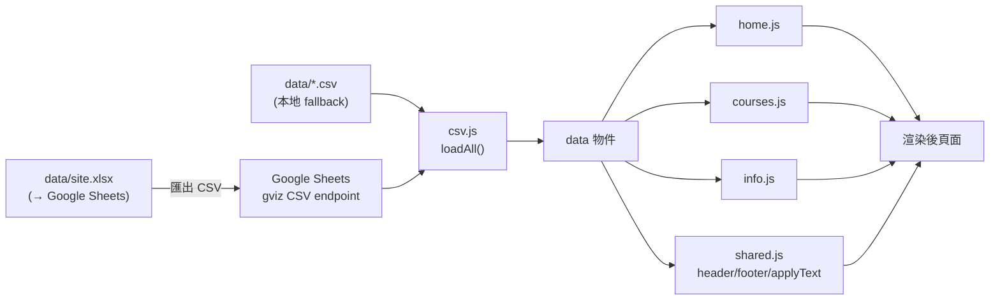

# LineWebDemo 資料驅動規格

全站文字與內容皆由試算表維護，程式碼不含任何寫死文案或商業邏輯。維護者只編輯 `data/site.xlsx`（上傳成 Google Sheets），網站即跟著變動。

## 資料流

來源切換在 `assets/js/site-config.js`：`GOOGLE_SHEETS_ID` 留空讀本地 `data/*.csv`；填入後改抓線上試算表（須設「擁有連結者可檢視」）。

## 渲染機制

頁面分兩種注入方式：

1. **單一文字**：HTML 標籤掛 `data-cfg="鍵"`（純文字）或 `data-cfg-ml="鍵"`（多行，`\n`→` `），由 `shared.js` 的 `applyText(config)` 從 `config` 表填入。HTML 內保留原文字當 fallback，config 漏鍵時不會空白。
2. **重複結構**：容器掛 `data-xxx`，由各頁 JS 從對應資料表渲染。

| 容器屬性 | 資料表 | 負責檔案 |
|---|---|---|
| `data-about` | about | home.js |
| `data-series-preview` | series | home.js |
| `data-keywords` | keywords | home.js |
| `data-series-anchors` / `data-series-sections` | series + classes | courses.js |
| `data-calendar` | course_dates + classes | courses.js |
| `data-faq-list` | faqs | info.js |
| `data-refund-rows` | refund | info.js |
| `data-privacy-list` | privacy | info.js |

## 試算表結構

共 11 個分頁。「說明」分頁僅供維護者閱讀，程式不讀取；其餘 10 張皆被 `loadAll()` 載入。每張表第 1 列為欄位名（程式依賴，不可改名、刪欄、插欄）。

### config — 站台設定 + 全站文字

`key, value, note`。`key`/`value` 被程式使用，`note` 僅供維護者參考。分為站台設定與各頁文字兩類。

站台設定鍵：`line_oa_url`、`line_oa_id`、`contact_email`、`pdf_url`。

文字鍵命名規則：`home_*`（首頁）、`courses_*`（課程頁）、`info_*`（相關問題頁）、`nav_*`/`footer_*`/`site_name`（共用 header/footer）、`class_*`/`calendar_*`（課程卡片與行事曆）。完整清單見 xlsx config 分頁的 `note` 欄。

換行：值為 `home_hero_title`、`home_hero_subtitle` 等以 `data-cfg-ml` 注入者，用 `\n` 代表換行。

### classes — 班級清單（一列一班）

| 欄位 | 說明 |
|---|---|
| class_id | 班級代號，限 a-z 0-9 _，不可重複 |
| name | 班級名稱 |
| series | 所屬系列，**須與 series 表的 name 完全一致** |
| level | 難度 |
| region | 地區 |
| price | 費用（純數字整數） |
| age_range | 年齡層 |
| experience_requirement | 經驗代號，**須對應 exp_hints 表的 code** |
| duration_hours | 每堂時數 |
| transport_note | 交通說明 |
| activity_areas | 活動範圍 |
| description | 課程簡介（卡片用） |
| display_order | 顯示順序 |
| price_unit | 價格單位（例：／每位小孩；無則留空） |
| fee_included | 費用包含項目（詳情頁摺疊；留空則不顯示摺疊區） |

### course_dates — 課程日期（一列一堂）

`class_id, session_no, date, weekday, time_period, notes`。`class_id` 關聯 classes；`date` 須 `YYYY-MM-DD` 文字格式（避免被 Google 自動轉成 9/5/2026）。

### faqs — 常見問題（一列一題）

`order, category, question, answer`。`answer` 內換行用 Alt+Enter（Mac：Option+Enter）。

### series — 三大系列

| 欄位 | 說明 |
|---|---|
| series_id | 系列代號，英數小寫，當網址錨點（例：mountain） |
| name | 系列名稱，**須與 classes 表的 series 完全一致** |
| title | 區塊標題（例：山野成長系列 / 原野觀察教室） |
| tagline | 課程頁分區副標 |
| preview_desc | 首頁系列卡片簡介 |
| display_order | 顯示順序 |

新增系列：在 series 加一列（取好 series_id），classes 對應 class 的 series 欄填同名即可，首頁與課程頁都會自動長出。

### keywords — 首頁四宮格

`display_order, name, description`。

### about — 首頁品牌故事段落

`display_order, style, text`。`style` 控制呈現位置與樣式：`lead`（大字，常顯）、`muted`（灰字，常顯）、`body`（內文，收進「閱讀完整故事」）、`emphasis`（綠字重點，收進摺疊）。`text` 可 Alt+Enter 換行。

### refund — 退費規定表

`display_order, stage, ratio`。一列一階段。

### privacy — 個資聲明段落

`display_order, heading, body`。`body` 可 Alt+Enter 換行。

### exp_hints — 經驗代號對照

`code, hint`。classes 的 `experience_requirement` 存代號（如「無」），詳情頁顯示對應 `hint`（如「無戶外或爬山經驗」）。

## 維護注意事項

- `class_id`、`series_id` 一律英數小寫，中文會壞。
- 跨表關聯務必一致：`classes.series` ↔ `series.name`、`course_dates.class_id` ↔ `classes.class_id`、`classes.experience_requirement` ↔ `exp_hints.code`。
- 日期欄保持純文字 `YYYY-MM-DD`。
- 各表第 1 列欄位名不可改、不可刪欄插欄；如需新欄請先改對應 JS。
- 重新產生 xlsx 模板：`python3 scripts/build_site_xlsx.py`（需 `pip install openpyxl`）。
