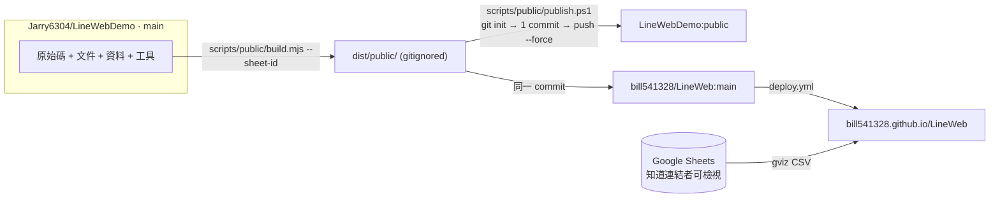

# LineWebDemo 乾淨發布版（public build）

> 從 `main` 產出「只有網站輸出」的乾淨樹：無註解、無資料檔、無文件、無工具；以單一 commit 推到 `Jarry6304/LineWebDemo:public` 與客戶 repo `bill541328/LineWeb:main`。

## 背景與動機

`main` 是開發用 source of truth（README、dataspec、CSV、xlsx、build script、註解都在這）。客戶 repo 只該看到網站本身。手動維護第二條乾淨分支會漂移、每次同步都要重刪註解，因此改為 **build 產出 + 腳本發布**：可重跑、可驗證、失敗不推送。

## 目標 / 非目標

| 目標 | 非目標 |
|---|---|
| `dist/public/` 檔案集合 == allowlist，多一個少一個都 fail | 混淆、minify、改識別字 |
| HTML / CSS / JS（含 inline `<script>`）零註解 | 改任何執行邏輯（build 前後語意相同） |
| 資料來源只剩 Google Sheets，ID 由 build 注入 | 動 `main` 既有檔案（只新增工具、`.gitignore` 一行、README 一段） |
| 發布 = 單一 orphan commit + `--force`，可重複執行 | 客戶端設定（Pages 啟用、collaborator、重建 repo）— 人工 |
| Verify 內建於 build，任一失敗 exit 1、不推送 | 隱藏 `LICENSE`、頁面文字、`<title>`/OG meta（本來就公開） |

## 架構



## Chain 契約

| 階段 | 動作 | 輸入 | 輸出 | 失敗處理 |
|---|---|---|---|---|
| 1 Select | 清空 `dist/public/`，依 allowlist **列舉**複製 | `main` 工作樹 | dist 骨架 | allowlist 檔案缺失 → exit 1 |
| 2 Transform | 依副檔名去註解；生成 `site-config.js` 注入 ID | Stage 1 | 同路徑改寫 | 工具錯誤 → exit 1 |
| 3 Verify | 集合比對、註解掃描、禁用字、ID、語意等價 | Stage 2 | 通過 / 報告 | 任一失敗 → exit 1，dist 保留供檢視 |
| 4 Publish | temp `git init` → 單一 commit → `push --force` ×2 → 清 `.git` | Stage 3 通過 | 遠端更新 | build exit≠0 → 不執行；push 失敗 → 原樣顯示 |

各階段細則見 `references/build-rules.md`。

## 介面

```powershell
npm run build:public -- --sheet-id <ID>          # Stage 1–3，不推送；亦可用 $env:LINEWEB_SHEET_ID
.\scripts\public\publish.ps1 -SheetId <ID> -DryRun   # build + 印出 dist 樹，不推送
.\scripts\public\publish.ps1 -SheetId <ID>           # 推 bill541328/LineWeb:main 與 LineWebDemo:public
.\scripts\public\publish.ps1 -SheetId <ID> -Remote <url> -Branch main -PublicBranch public
```

## 實作交付物

| 檔案 | 內容 |
|---|---|
| `package.json` + `package-lock.json` | `private:true`、`type:module`、devDeps `esbuild`、`html-minifier-terser`、script `build:public` |
| `scripts/public/build.mjs` | Stage 1–3；exit code 即契約 |
| `scripts/public/publish.ps1` | Stage 4；參數見上 |
| `.gitignore` | 加 `dist/` |
| `README.md`（main） | 新增「發布乾淨版」段落：3 行指令 + 指向本規格 |

## 關鍵決策

| 決策 | 取捨方案 | Rationale |
|---|---|---|
| Build 產出而非手維護分支 | 手動 clean 分支 / 腳本產出 | 分支會漂移，每次同步要重刪註解 |
| 去註解用 esbuild（JS/CSS）+ html-minifier-terser（HTML 僅 `removeComments`，inline script 交 esbuild） | regex / 全 minify | regex 會誤傷字串內 `//`（gviz URL）；esbuild 已實測去註解不改語意 |
| 不 minify、不改識別字 | 全 minify | 客戶 repo 仍可讀、可 diff、可除錯；「無資訊」指註解與文件，不指語意 |
| HTML `data-cfg` fallback 文字**保留** | 清空 | 頁面文字本來就公開；清空造成首屏空白、SEO / LINE 預覽變差 |
| `data/`、`site.xlsx`、`scripts/`、`README`、`dataspec`、`.gitignore` 不進 dist | 留精簡版 | 純輸出 repo 沒東西要 ignore；文件全在 `main` |
| `LICENSE` 保留 | 移除 | MIT 要求保留聲明；無額外資訊 |
| 單一 orphan commit + `--force`，訊息固定 `Publish site` | 累加 commit | 客戶 repo 永遠只有 1 筆，無軌跡 |
| Sheet ID 用參數注入，`main` 的 `site-config.js` 維持 `''` | 寫死在 main | main 是 demo，不綁客戶資料；ID 本來就公開，非密鑰 |
| `csv.js` 保留本地 CSV fallback 邏輯 | 刪 | 「不改邏輯」；ID 必填，死碼無害 |
| Claude Code 只跑到 `-DryRun`，真正 push 由人執行 | 全自動 | force push 客戶 repo 不可逆，且需客戶先重建 repo + 加 collaborator |

## 驗收條件

- [ ] 給定 `main`，當 `npm run build:public -- --sheet-id X`，則 `dist/public/` 檔案集合與 allowlist 完全相等
- [ ] 給定 dist，當掃描 `*.html` 的 `<!--`、`*.css` / `*.js` / inline `<script>` 的 `/*` 與行首 `//`，則命中 = 0
- [ ] 給定 dist，當掃描禁用字表，則命中 = 0（`LICENSE` 除外）
- [ ] 給定 dist，則 `assets/js/site-config.js` 內容 == 模板帶入 X（無註解）
- [ ] 給定未帶 `--sheet-id` 且無環境變數，當 build，則 exit 1 且 `dist/public/` 不存在
- [ ] 給定每個 `.js` / `.css`，當 `esbuild --minify` 分別處理 main 版與 dist 版，則輸出 byte-identical（`site-config.js` 以 X 代入 main 版後比較）
- [ ] 給定同一 `main` commit 跑兩次 build，則 dist 內容雜湊相同（可重現）
- [ ] 給定 Verify 任一失敗，當執行 `publish.ps1`，則不發生任何 `git push`
- [ ] 給定 dist 以 `python -m http.server` 服務、X 指向可讀的測試試算表，當開 3 頁 + `404.html` + `error.html`，則無 console error、fetch 只打 `docs.google.com` / `fonts.*`
- [ ] 給定 build 後 `main` 的 `git status`，則只出現首次新增的 `package*.json`、`scripts/public/*`、`.gitignore`、`README.md` 變更
- [ ] 給定 publish 成功，則客戶 repo `main` 恰 1 commit、樹 == allowlist、Actions 綠勾、站台可開

## 邊界 / 例外

| 情境 | 行為 |
|---|---|
| 客戶在他的 repo 直接改檔 | 下一次 publish 覆蓋；一切變更回 `main` 改再發布 |
| 想在 dist / 客戶 repo `git merge demo/main` | 禁止：會拉回全部歷史；同步只有 build + publish 一條路 |
| 新增頁面或資產 | 必須同步改 allowlist，否則 Verify fail（設計如此，防漏檔 / 多檔） |
| Google Fonts、gviz 外部依賴、Pages 啟用 | 不在範圍，維持現狀 / 人工 |

## 漸進載入指引

| 任務 | 查閱 |
|---|---|
| allowlist、各檔型轉換參數、禁用字表、Verify 方法、`publish.ps1` 範本 | `references/build-rules.md` |
